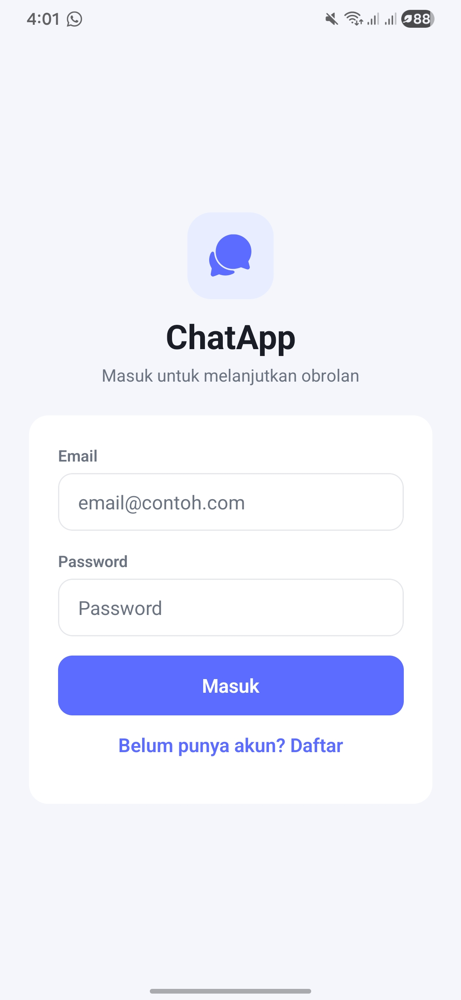
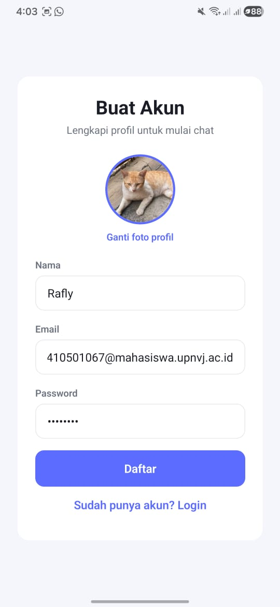
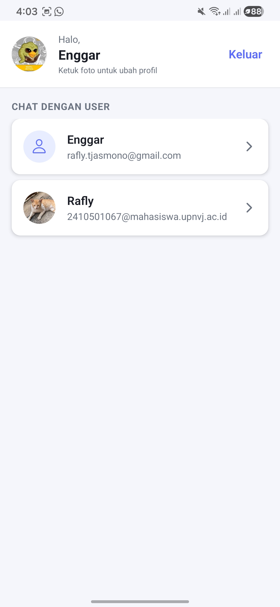
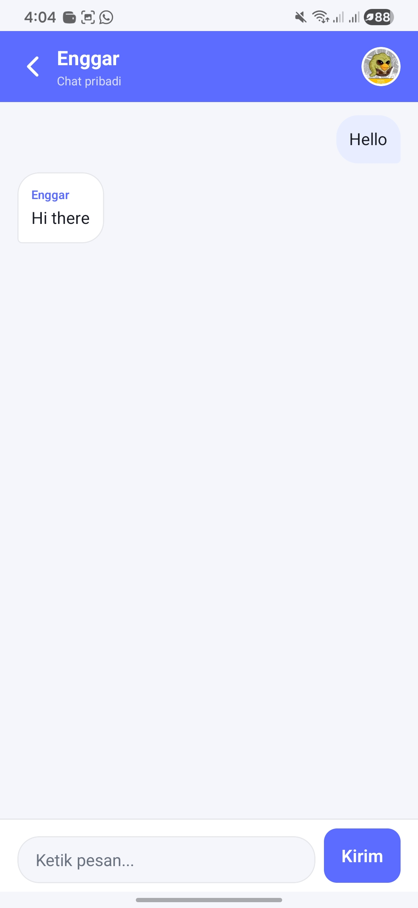
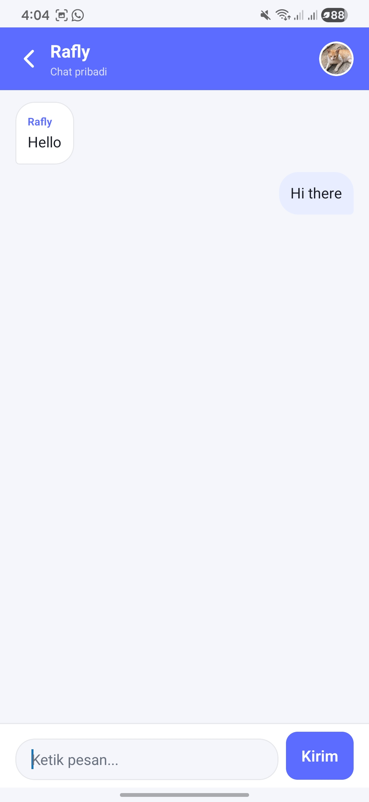

# ChatApp

Aplikasi chat mobile berbasis React Native (Expo) dengan autentikasi Firebase dan pesan real-time melalui Cloud Firestore.

## Informasi Proyek

| Field             | Isi                        |
| ----------------- | -------------------------- |
| Mata Kuliah       | Pemrograman Mobile Lanjut  |
| Praktikum / Tugas | P11 / Firebase Intregation |
| Nama              | Rafly Enggar Tiarso        |
| NIM               | 2410501067                 |
| Kelas             | B                          |

## Deskripsi

ChatApp memungkinkan pengguna terdaftar untuk login, mengelola foto profil sendiri, melihat daftar user lain, dan mengirim pesan dalam chat pribadi (DM) antar dua akun. Data profil disimpan di koleksi `users`, pesan disimpan di koleksi `messages` dengan field `roomId` untuk memisahkan percakapan.

## Fitur

- Registrasi dan login dengan Firebase Authentication (email/password)
- Upload foto profil saat registrasi (opsional)
- Ubah foto profil hanya dari layar daftar user (akun sendiri)
- Daftar user terdaftar untuk memulai chat pribadi
- Chat real-time dengan `onSnapshot`
- Avatar di layar chat menampilkan foto lawan bicara
- Notifikasi sukses/gagal untuk login dan registrasi
- UI dengan komponen bersama dan ikon vektor (`@expo/vector-icons`)

## Tech Stack

- React Native 0.81 + Expo SDK 54
- TypeScript
- React Navigation (Stack)
- Firebase JS SDK (Auth, Firestore, Storage)
- expo-image-picker
- react-native-safe-area-context

## Persyaratan

- Node.js 18 atau lebih baru
- npm atau yarn
- Expo Go (untuk pengujian di perangkat) atau Android Studio / Xcode (build native)
- Akun Firebase dengan project aktif

## Instalasi

```bash
cd ChatApp
npm install
```

## Konfigurasi Firebase

1. Buat project di [Firebase Console](https://console.firebase.google.com/).
2. Aktifkan **Authentication** metode Email/Password.
3. Buat database **Cloud Firestore** (mode production atau test sesuai kebutuhan).
4. Aktifkan **Storage** untuk upload foto profil.
5. Salin konfigurasi web app ke `firebaseConfig.ts`:

```ts
const firebaseConfig = {
  apiKey: "...",
  authDomain: "...",
  projectId: "...",
  storageBucket: "...",
  messagingSenderId: "...",
  appId: "...",
};
```

6. Terapkan aturan Firestore berikut di tab **Rules**:

```
rules_version = '2';
service cloud.firestore {
  match /databases/{database}/documents {
    match /users/{userId} {
      allow read: if request.auth != null;
      allow write: if request.auth.uid == userId;
    }
    match /messages/{msgId} {
      allow read, write: if request.auth != null;
    }
  }
}
```

7. Atur aturan **Storage** agar user hanya dapat menulis ke path profil sendiri (sesuaikan dengan kebijakan tim Anda).

## Menjalankan Aplikasi

```bash
npm start
```

Perintah lain:

| Perintah          | Keterangan              |
| ----------------- | ----------------------- |
| `npm run android` | Expo + emulator Android |
| `npm run ios`     | Expo + simulator iOS    |
| `npm run web`     | Jalankan di browser     |

## Struktur Folder

```
ChatApp/
├── App.tsx                 # Navigator utama
├── firebaseConfig.ts       # Inisialisasi Firebase
├── index.ts
├── assets/
├── components/
│   ├── AppButton.tsx
│   ├── AppIcon.tsx
│   ├── AppTextInput.tsx
│   ├── ProfileAvatarPicker.tsx
│   └── ScreenLayout.tsx
├── constants/
│   ├── theme.ts
│   └── icons.ts
├── screens/
│   ├── LoginScreen.tsx
│   ├── RegisterScreen.tsx
│   ├── UserListScreen.tsx
│   └── ChatScreen.tsx
└── utils/
    ├── firebaseAuthErrors.ts
    ├── firestoreErrors.ts
    ├── profilePhoto.ts
    ├── rooms.ts
    └── userProfile.ts
```

## Alur Penggunaan

1. Buka aplikasi, pilih **Daftar** atau **Masuk**.
2. Setelah login, tampil daftar user lain di **UserListScreen**.
3. Ketuk foto profil di header untuk mengganti foto **milik sendiri**.
4. Ketuk salah satu user untuk membuka chat pribadi.
5. Di **ChatScreen**, kirim pesan; avatar kanan atas adalah foto **lawan bicara**.
6. Gunakan tombol kembali untuk kembali ke daftar user; **Keluar** untuk logout.

## Model Data

### Koleksi `users/{userId}`

| Field    | Tipe    | Keterangan      |
| -------- | ------- | --------------- |
| name     | string  | Nama tampilan   |
| email    | string  | Email akun      |
| photoURL | string  | URL foto profil |
| isOnline | boolean | Status online   |

### Koleksi `messages/{messageId}`

| Field      | Tipe      | Keterangan                      |
| ---------- | --------- | ------------------------------- |
| roomId     | string    | ID room DM (`dm_{uid1}_{uid2}`) |
| senderId   | string    | UID pengirim                    |
| senderName | string    | Nama pengirim                   |
| text       | string    | Isi pesan                       |
| timestamp  | timestamp | Waktu kirim (server)            |

## Pengujian

- [ ] Registrasi akun baru berhasil
- [ ] Login dan logout berhasil
- [ ] Upload dan ubah foto profil (hanya akun sendiri)
- [ ] Daftar user tampil setelah ada minimal 2 akun
- [ ] Pesan terkirim dan tampil real-time di kedua perangkat
- [ ] Avatar di chat menampilkan foto lawan bicara
- [ ] Akses ditolak jika belum login (sesuai rules)

## Troubleshooting

| Masalah                            | Solusi                                              |
| ---------------------------------- | --------------------------------------------------- |
| `permission-denied` di Firestore   | Pastikan user sudah login dan rules sudah dipublish |
| Pesan tidak muncul                 | Periksa field `roomId` pada dokumen pesan           |
| Upload foto gagal                  | Periksa rules Firebase Storage dan koneksi internet |
| Error modul `preserve` di tsconfig | Set `"module": "ESNext"` di `tsconfig.json`         |

## Screenshots

Letakkan gambar di folder `screenshots/`. Contoh penamaan file:

| File            | Layar        |
| --------------- | ------------ |
| `login.png`     | Login        |
| `register.png`  | Registrasi   |
| `user-list.png` | Daftar user  |
| `chat.png`      | Chat pribadi |

### Login



### Registrasi



### Daftar User



### Chat




## Referensi

- [Dokumentasi Expo](https://docs.expo.dev/)
- [Dokumentasi Firebase](https://firebase.google.com/docs)
- [React Navigation](https://reactnavigation.org/)
